# School District Analysis

## Overview
The school board has notified school leadership that the original data file used for a recent analysis of the school district shows evidence of academic dishonesty. Reading and math grades for Thomas High School ninth graders appear to have been changed. The school board does not know how far the academic dishonesty extends, so they want to ensure that state-testing standards are upheld and are seeking help. School leadership has asked to replace the math and reading scores for Thomas High School with NaNs while keeping the rest of the data the same. Once the math and reading scores have been replaced, school leadership wants to repeat the school district analysis that was done earlier and would like a written report, describing how the changes to the Thomas High School ninth grade data affected the overall analysis.

## Results
The repeat of the analysis of school district data did reveal some effects from the changes to the Thomas High School ninth grade data, but they appear to be mostly minor. The following breaks down the analysis results in more detail:

- **Affects on the district summary**

    There were some slight differences in the District Summary. The Average Math Score dropped 0.1 from 79.0 to 78.9, the % Passing Math dropped 0.2 from 75% to 74.8%, the % Passing Reading dropped 0.3% from 86% to 85.7%, and the % Overall Passing dropped 0.1% from 65% to 64.9%. (see *District Summary DataFrames*, below)
    ##### *Original District Summary DataFrame*
    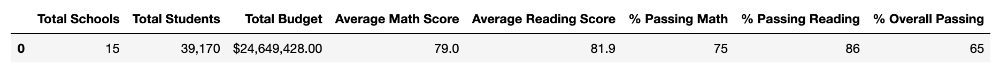
    
    ##### *New District Summary DataFrame*
    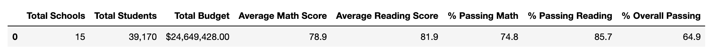

- **Affects on the school summary**

    There were some slight differences in the School Summary, affecting only Thomas High School, as expected. The Average Math Score dropped from 83.418349	to 83.350937, the Average Reading Score rose from 83.848930 to 83.896082, the % Passing Math dropped from 93.272171% to 93.185690%, the % Passing Reading dropped from 97.308869% to 97.018739%, and the % Overall Passing dropped from 90.948012% to 90.630324%. (see *School Summary DataFrames*, below)
    ##### *Original School Summary DataFrame*
    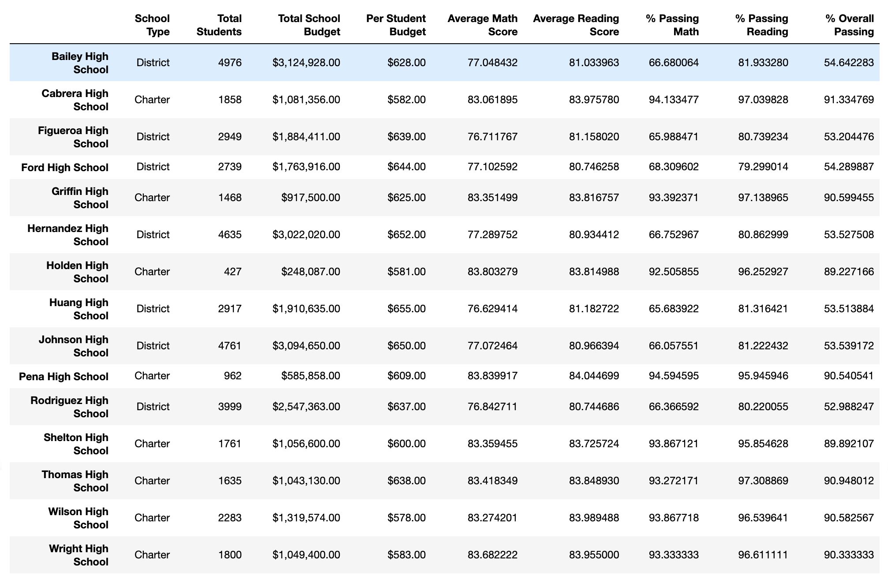
    
    ##### *New School Summary DataFrame*
    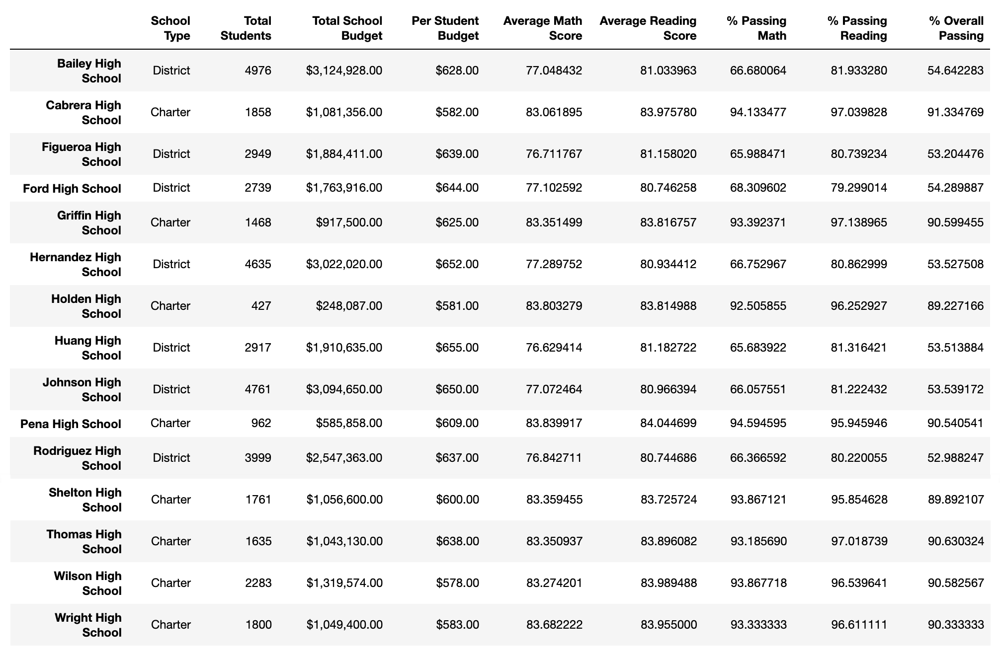

- **Affects on Thomas High School's performance relative to the other schools, as a result of replacing the ninth graders' math and reading scores**

    Though Thomas High School's % Overall Passing dropped by a little over 0.3%, it wasn't enough to change it's 2nd place position relative to other schools. (see *School Performance DataFrames*, below)
    ##### *Original School Performance DataFrame*
    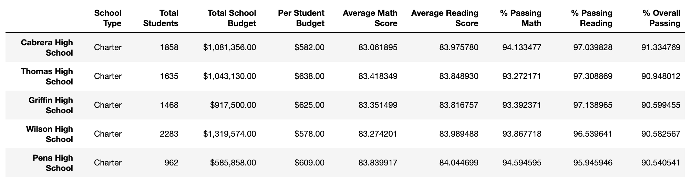
    
    ##### *New School Performance DataFrame*
    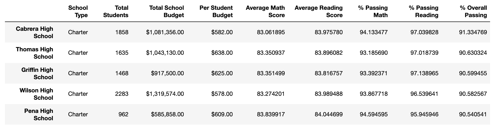

- **Affects on the following, as a result of replacing the ninth-grade scores:**
  - **Math and reading scores by grade**

    **Math:** The only affect was on the Thomas High School 9th grade Math Scores, which  were completely removed (NaN). (see *Math Scores by Grade DataFrames*, below)
    ##### *Original Math Scores by Grade DataFrame*
    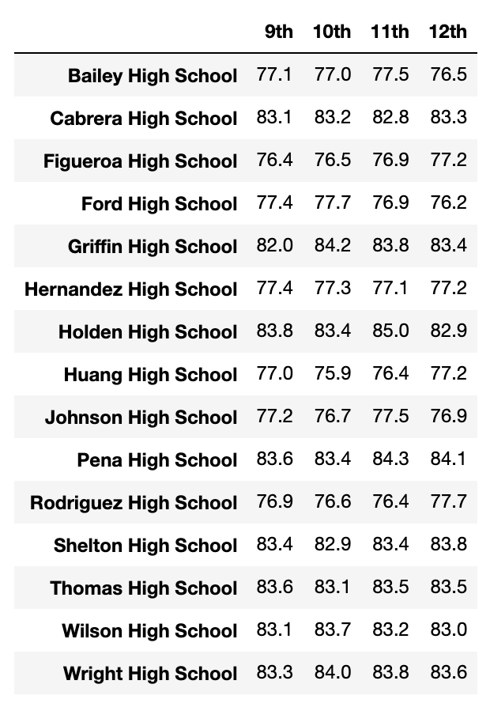
    
    ##### *New Math Scores by Grade DataFrame*
    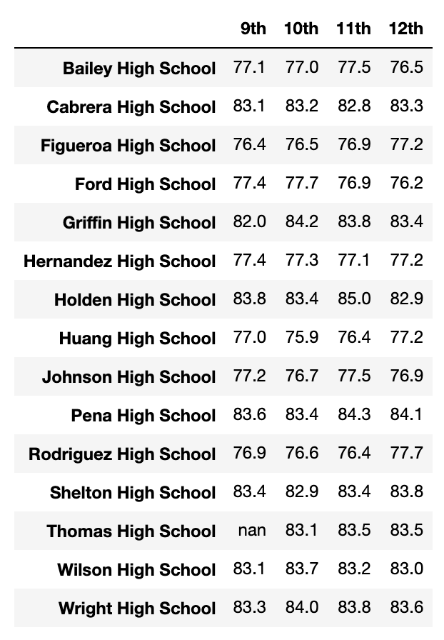

    **Reading:** The only affect was on the Thomas High School 9th grade Reading Scores, which  were completely removed (NaN). (see *Reading Scores by Grade DataFrames*, below)
    ##### *Original Reading Scores by Grade DataFrame*
    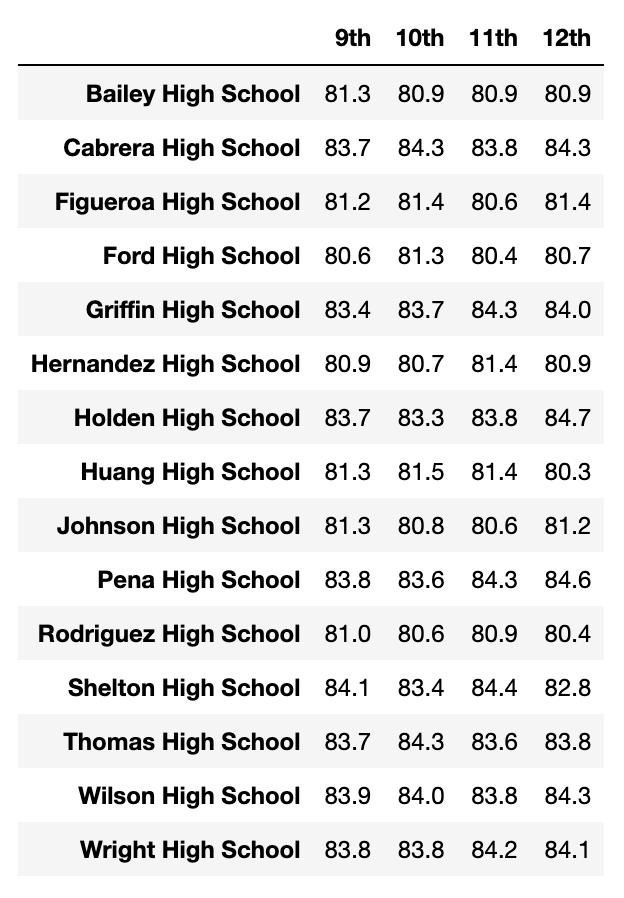
    
    ##### *New Reading Scores by Grade DataFrame*
    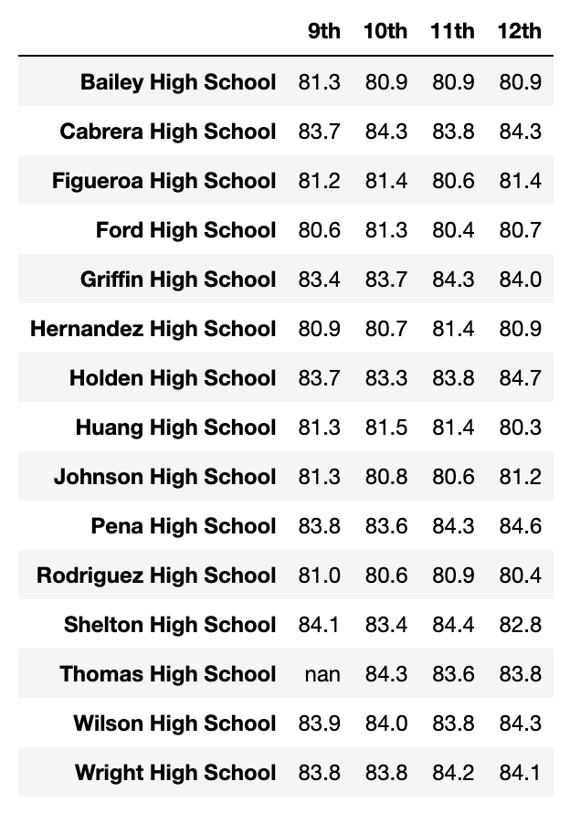

  - **Scores by school spending**

    There were slight fluctuations in the scores and percentages within the $630-644 Spending Range(Per Student), which is where Thomas High School fits. (see *Scores by School Spending DataFrames*, below)
    ##### *Original Scores by School Spending DataFrame*
    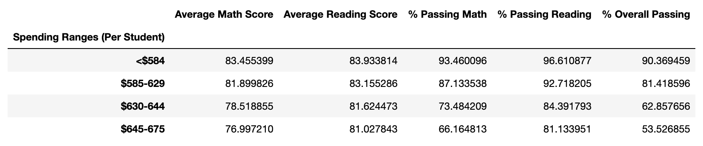
    
    ##### *New Scores by School Spending DataFrame*
    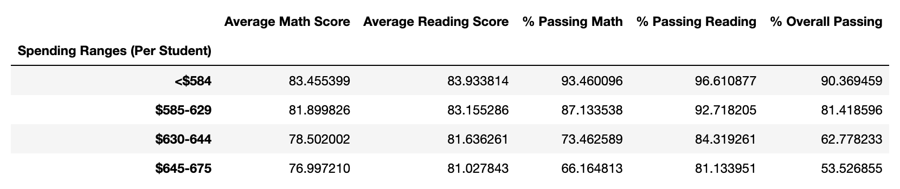

  - **Scores by school size**

    There were slight fluctuations in the scores and percentages within the Medium (1000-2000) school size range, which is where Thomas High School fits, but so small that when rounded, the numbers didn't change. (see *Scores by School Size DataFrames*, below)
    ##### *Original Scores by School Size DataFrame*
    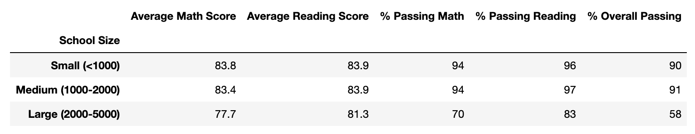
    
    ##### *New Scores by School Size DataFrame*
    

  - **Scores by school type**

    There were slight fluctuations in the scores and percentages within the Charter school type range (Thomas High School is a charter school), but so small that when rounded, the numbers didn't change. (see *Scores by School Type DataFrames*, below)
    ##### *Original Scores by School Type DataFrame*
    
    
    ##### *New Scores by School Type DataFrame*
    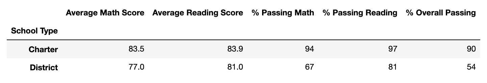

## Summary
The repeat of the analysis of school district data did reveal some effects from the changes to the Thomas High School ninth grade data, but they appear to be mostly minor. Four key findings include:
- There were some slight differences in the District Summary Math and Reading scores, but they were very small.
- Though Thomas High School's % Overall Passing dropped by a little over 0.3%, it wasn't enough to change it's 2nd place position relative to other schools.
- There were slight fluctuations in the scores and percentages within the Medium (1000-2000) school size range, which is where Thomas High School fits, but so small that when rounded, the numbers didn't change.
- There were slight fluctuations in the scores and percentages within the Charter school type range (Thomas High School is a charter school), but so small that when rounded, the numbers didn't change.

