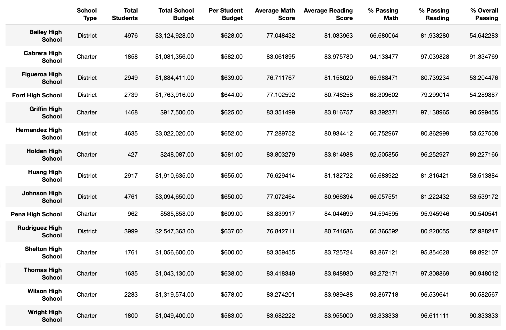

# School District Analysis

## Overview
The school board has notified school leadership that the original data file used for a recent analysis of the school district shows evidence of academic dishonesty. Reading and math grades for Thomas High School ninth graders appear to have been changed. The school board does not know how far the academic dishonesty extends, so they want to ensure that state-testing standards are upheld and are seeking help. School leadership has asked to replace the math and reading scores for Thomas High School with NaNs while keeping the rest of the data the same. Once the math and reading scores have been replaced, school leadership wants to repeat the school district analysis that was done earlier and would like a written report, describing how the changes to the Thomas High School ninth grade data affected the overall analysis.

## Results
The repeat of the analysis of school district data did reveal some effects from the changes the Thomas High School ninth grade data, but they appear to be mostly minor. The following breaks down the analysis results in more detail:

- **Affects on the district summary**

    There were some slight differences in the District Summary. The % Passing Math score . (see *Original District Summary DataFrame*, below)
    ##### *Original District Summary DataFrame*
    
    
    ##### *New District Summary DataFrame*
    

- **Affects on the school summary**

    This is a sentence. (see *Original District Summary DataFrame*, below)
    ##### *Original School Summary DataFrame*
    
    
    ##### *New School Summary DataFrame*
    

- **Affects on Thomas High School's performance relative to the other schools, as a result of replacing the ninth graders' math and reading scores**

    This is a sentence. (see *Original District Summary DataFrame*, below)
    ##### *Original School Performance DataFrame*
    
    
    ##### *New School Performance DataFrame*
    

- **Affects on the following, as a result of replacing the ninth-grade scores:**
  - **Math and reading scores by grade**

    This is a sentence. (see *Original District Summary DataFrame*, below)
    ##### *Original Math Scores by Grade DataFrame*
    
    
    ##### *New Math Scores by Grade DataFrame*
    

    This is a sentence. (see *Original District Summary DataFrame*, below)
    ##### *Original Reading Scores by Grade DataFrame*
    
    
    ##### *New Reading Scores by Grade DataFrame*
    

  - **Scores by school spending**

    This is a sentence. (see *Original District Summary DataFrame*, below)
    ##### *Original Scores by School Spending DataFrame*
    
    
    ##### *New Scores by School Spending DataFrame*
    

  - **Scores by school size**

    This is a sentence. (see *Original District Summary DataFrame*, below)
    ##### *Original Scores by School Size DataFrame*
    
    
    ##### *New Scores by School Size DataFrame*
    

  - **Scores by school type**

    This is a sentence. (see *Original District Summary DataFrame*, below)
    ##### *Original Scores by School Type DataFrame*
    
    
    ##### *New Scores by School Type DataFrame*
    

## Summary
EDITS NEEDED: There is a statement summarizing four changes to the school district analysis after reading and math scores have been replaced.

